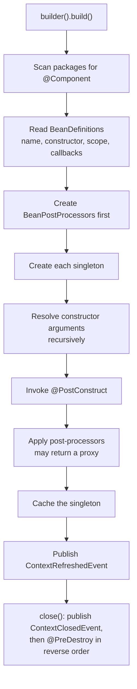

# minispring

[](https://github.com/ELMAALMIA/minispring/actions/workflows/ci.yml)
[](https://sonarcloud.io/summary/overall?id=ELMAALMIA_minispring)
[](https://sonarcloud.io/summary/overall?id=ELMAALMIA_minispring)
[](https://sonarcloud.io/summary/overall?id=ELMAALMIA_minispring)

A dependency injection container written from scratch in Java 21 to make Spring's machinery visible: component scanning, constructor injection, scopes, lifecycle callbacks, application events and proxy-based `@Transactional`.

**It is not a Spring replacement.** It is about 900 lines of code with no runtime dependencies, meant to be read top to bottom in an afternoon. Every design decision should be explainable in a sentence, and this README tries to do exactly that.

```java
public interface Greeter {
    String greet(String name);
}

@Component
class PoliteGreeter implements Greeter {
    public String greet(String name) { return "Hello, " + name; }
}

@Component
class WelcomeService {
    private final Greeter greeter;

    WelcomeService(Greeter greeter) { this.greeter = greeter; } // a single constructor needs no annotation

    @PostConstruct
    void ready() { System.out.println("WelcomeService is ready"); }

    String welcome(String name) { return greeter.greet(name) + "!"; }
}

try (var context = AnnotationApplicationContext.scan("com.example")) {
    System.out.println(context.getBean(WelcomeService.class).welcome("Ada")); // Hello, Ada!
}
```

## Contents

- [Build and run](#build-and-run)
- [The lifecycle](#the-lifecycle)
- [Architecture and design patterns](#architecture-and-design-patterns)
- [How it works, concept by concept](#how-it-works-concept-by-concept)
- [Side by side with real Spring](#side-by-side-with-real-spring)
- [Quality gates](#quality-gates)
- [Limitations](#limitations)
- [Read the commit history](#read-the-commit-history)

## Build and run

The build needs JDK 21; the Maven wrapper brings its own Maven.

```bash
./mvnw verify                                      # 79 tests, coverage gate included
./mvnw -q -pl demo -am compile exec:exec           # the order demo on minispring
./mvnw -q -pl demo -am compile exec:exec -Ddemo.args=--serve   # ...and serve GET /orders on port 8080
scripts/compare-with-spring.sh                     # run both demos and diff their output
```

| Module | What it is |
|---|---|
| `container` | The container itself. Zero runtime dependencies, only the JDK. |
| `demo` | An order service running on minispring. |
| `demo-spring` | The same business classes running on Spring Boot 3.5, as a behavioral reference. |

## The lifecycle



**Why post-processing comes after `@PostConstruct`.** A post-processor may replace the bean with a proxy. If the proxy were created first, `@PostConstruct` would run against the proxy: the initialization method might not be on any interface, and even if it were, the proxy would treat an internal setup step as a business call and could wrap it in a transaction. Running `@PostConstruct` first means the proxy always wraps an object that is already fully initialized. For the same reason, the container keeps the **raw** bean for `@PreDestroy`, because a JDK proxy only exposes interface methods.

## Architecture and design patterns

```
io.minispring.container
├── annotation/   @Component, @Autowired, @Qualifier, @Primary, @Scope, @PostConstruct, @PreDestroy, @Transactional
├── scan/         ClasspathScanner: finds @Component classes on disk
├── bean/         BeanDefinition, BeanDefinitionReader, BeanRegistry, DependencyResolver, BeanFactory, BeanPostProcessor
├── context/      ApplicationContext, AnnotationApplicationContext (+ Builder), context events
├── event/        ApplicationEvent, ApplicationListener, ApplicationEventPublisher, ApplicationEventMulticaster
├── transaction/  TransactionalProcessor, TransactionManager, ConsoleTransactionManager
├── web/          @RestController, @GetMapping, DispatcherServer
└── exception/    a sealed hierarchy rooted at ContainerException
```

Dependencies only point downwards: `context` assembles `scan`, `bean`, `event` and `transaction`, and none of those know about `context`. Each class has one job, so each one has its own focused test class.

Patterns are used where they remove a real problem, and named in the Javadoc where they appear:

| Pattern | Where | The problem it solves |
|---|---|---|
| **Facade** | `AnnotationApplicationContext` | One entry point over the scanner, reader, registry, resolver and factory. |
| **Builder** | `AnnotationApplicationContext.builder()` | Combines scanned packages and explicit classes. `build()` creates *and* starts the context, so a half-started context is never visible. |
| **Static factory methods** | `AnnotationApplicationContext.scan/of`, `Dependency.on/of` | Constructors with names that say what they build. |
| **Factory** | `BeanFactory` | Creates objects from descriptions (`BeanDefinition`) and decides caching by scope. |
| **Registry** | `BeanRegistry` | A single, ordered, name-indexed source of truth for definitions. |
| **Strategy** | `TransactionManager` | The proxy decides *when* a transaction starts; the strategy decides *what* a transaction is. Declare a bean to replace the console one. |
| **Proxy** | `TransactionalProcessor`, `TransactionalInvocationHandler` | Adds behavior around calls without touching the bean's code. |
| **Chain of responsibility** | `BeanPostProcessor` pipeline | Each processor can inspect, wrap or replace a bean, then pass it on. |
| **Observer** | `ApplicationEventMulticaster`, `ApplicationListener`, `ApplicationEventPublisher` | Publishers and listeners only share an event type; neither knows the other exists. |
| **Front controller** | `DispatcherServer` | One HTTP handler that dispatches every request through a route table. |
| **Value object** | `BeanDefinition`, `Dependency` (records) | Immutable descriptions that are safe to share and compare. |

Patterns deliberately **not** used:
- **GoF Singleton.** A "singleton" bean is one instance *per context*, held by the container, not a static global.
- **Service Locator.** `getBean` exists to bootstrap an application; beans receive their collaborators through constructors.

## How it works, concept by concept

### Scanning: annotations are inert metadata

Java has no API to list the classes of a package. `ClasspathScanner` asks the class loader for the package's directory and walks it with `Files.walk`. Three details matter:

- `@Component` has `RetentionPolicy.RUNTIME`. The default, `CLASS`, drops the annotation before reflection can see it, and the scanner silently finds nothing.
- Classes are loaded with `Class.forName(name, false, loader)`: finding a class must not run its static initializers.
- Results are sorted by name, so startup order is deterministic on every machine.

`@RestController` is itself annotated with `@Component`, and the scanner follows one level of meta-annotation. That is all a Spring "stereotype" is.

### Describing a bean before creating it

A `BeanDefinition` is a record holding the name, class, constructor, scope and lifecycle methods, but no instance. Separating the description from the instance is what makes scopes (create it once, or many times) and proxies (hand out something else) possible. `BeanDefinitionReader` applies the rules once, at startup:

- **Name:** the `@Component` value, or the decapitalized class name (`OrderService` becomes `orderService`, while `URLParser` stays `URLParser`, following the JavaBeans rule Spring uses).
- **Constructor:** the only one; otherwise the one marked `@Autowired`; otherwise an error that lists every candidate.
- **Lifecycle:** at most one `@PostConstruct` and one `@PreDestroy`, both without parameters. Invalid classes fail before anything is created.

### Resolving a dependency

For each constructor parameter, `DependencyResolver` collects the beans whose type is assignable to it. If a `@Qualifier` is present, it picks by name; otherwise a single `@Primary` wins. **The container never guesses.** Spring's ambiguity message is famously unhelpful, so this one names every candidate and the exact injection point:

```
2 beans of type com.example.PaymentGateway match, required by parameter 'gateway' of bean 'checkout':
[stripeGateway, paypalGateway]. Mark one with @Primary, or choose one with @Qualifier("name").
```

### Why cycles are refused

`BeanFactory` records the beans currently under construction in an insertion-ordered set. If a bean is requested while it is still in that set, the set, read from that bean onwards, *is* the cycle:

```
Circular dependency: rock -> paper -> scissors -> rock. Constructor injection cannot create a bean
before its own dependencies exist; move the shared logic into a separate bean to break the cycle.
```

With constructor injection, a real cycle cannot be resolved, because A cannot be constructed before B if each needs the other. Spring only resolves cycles for field injection, by handing out half-built objects through an early-reference cache. Refusing is a deliberate design choice.

### Scopes

Singletons are created eagerly at startup, so wiring errors appear immediately, and they are cached for the life of the context. Prototypes are created on every request and never cached. The container keeps no reference to a prototype, so **it never calls a prototype's `@PreDestroy`**. And a prototype injected into a singleton is created only once, because the singleton is built only once. Spring behaves the same way on both counts.

### Lifecycle callbacks

`@PostConstruct` runs after injection, so it can use the dependencies. `close()` runs `@PreDestroy` in **reverse creation order**, so a bean is destroyed while the beans it depends on still work. A failing `@PreDestroy` is logged and does not stop the others. If startup fails halfway, the singletons created so far are destroyed before the error propagates.

### Proxies and `@Transactional`

`TransactionalProcessor` is a `BeanPostProcessor`. When a bean has `@Transactional` methods, it returns a JDK dynamic proxy instead of the bean, and the container then injects that proxy everywhere. The proxy calls the `TransactionManager` around each transactional method:

- `RuntimeException` or `Error`: **rollback**. A checked exception: **commit**. These are Spring's defaults.
- The bean's original exception is rethrown, never the `InvocationTargetException` that reflection wraps it in.
- A `@Transactional` class with no interface, or a `@Transactional` method missing from every interface, fails at startup with an explanation. Otherwise the transaction would silently never happen.

### Why proxies break on self-invocation

This is one of the most common real-world Spring bugs, and the demo reproduces it on purpose:

```java
@Override
public void placeAll(List<String> items) {
    items.forEach(this::placeOrder);   // "this" is the bean, not the proxy: no transaction starts
}
```

The caller holds the proxy, but inside the bean `this` is the bean itself. Internal calls never pass through the proxy, so `@Transactional` on `placeOrder` is ignored. `TransactionalTest.selfInvocationBypassesTheProxyAndStartsNoTransaction` pins down this limitation, and the Spring twin shows that Spring behaves the same way.

A related trap: once proxied, a bean is no longer an instance of its class. Asking for `OrderServiceImpl` instead of `OrderService` gets an explanation instead of a `ClassCastException`:

```
Bean 'orderServiceImpl' is a jdk.proxy2.$Proxy9, not a com.example.OrderServiceImpl. It is a JDK
dynamic proxy, which only implements the interfaces [OrderService]: depend on one of those interfaces instead of the class.
```

### Events (Observer)

Beans receive an `ApplicationEventPublisher`, or even the `ApplicationContext` itself, through constructor injection. An `ApplicationListener<OrderPlacedEvent>` bean receives only `OrderPlacedEvent`s: the multicaster reads the type argument from the class declaration once, and caches it in a `ClassValue`. Listeners are looked up at publication time, so events published during startup still reach listeners that are created later. The context itself announces `ContextRefreshedEvent` and `ContextClosedEvent`.

### 100 lines of MVC

`DispatcherServer` shows that MVC dispatching is a lookup table: exact path → `@GetMapping` method, served by the JDK's built-in `HttpServer` on virtual threads, bound to localhost. It deliberately has no path variables, no JSON and no servlet container.

## Side by side with real Spring

`demo` and `demo-spring` contain **the same business classes**. The only differences are the import lines, which `diff` confirms:

```diff
 package io.minispring.demo;

-import io.minispring.container.annotation.Component;
-import io.minispring.container.annotation.Transactional;
-import io.minispring.container.event.ApplicationEventPublisher;
+import org.springframework.stereotype.Component;
+import org.springframework.transaction.annotation.Transactional;
+import org.springframework.context.ApplicationEventPublisher;
 import java.util.List;

 @Component
 public class OrderServiceImpl implements OrderService {
```

Both print exactly these lines, and each module has a test that asserts it against the shared file [docs/demo-output.txt](docs/demo-output.txt):

```
Repository ready
BEGIN    OrderServiceImpl.placeOrder
AUDIT    order placed: book
SHIP     book
COMMIT   OrderServiceImpl.placeOrder
Order placed: book
BEGIN    OrderServiceImpl.placeOrder
ROLLBACK OrderServiceImpl.placeOrder
Rejected: item must not be blank
AUDIT    order placed: pen
SHIP     pen
AUDIT    order placed: ink
SHIP     ink
Orders: book, pen, ink
Repository closed
```

That covers multi-level constructor injection, interface resolution, `@PostConstruct`/`@PreDestroy`, commit, rollback, events, and the self-invocation gap (`pen` and `ink` get no transaction). The Spring twin needs exactly one extra class: a `PlatformTransactionManager` that prints the same lines, because Spring has no console transaction manager.

**Startup time** for the identical application, cold JVM, on the author's machine: about **100 ms** for minispring against about **1.7 s** for Spring Boot. This is not a fair fight, and the reason is the interesting part. Spring Boot evaluates hundreds of conditional auto-configurations, reads annotation metadata from the whole classpath, builds an `Environment` from property sources, initializes a logging system, and generates CGLIB subclasses. minispring does none of that. The difference is the price of features that this project deliberately leaves out.

## Quality gates

- **79 tests** written with JUnit 5 and AssertJ only, and no mocks: when a test would need a mock, the design is too coupled. Tests read as sentences (`throwsWhenTwoBeansMatchAndNeitherIsPrimary`), and they check **error messages**, not just exception types.
- **Coverage gate:** JaCoCo fails the build if the container drops below 90% line or 80% branch coverage. Today it is at 94.8% and 87.6%.
- **Strict compilation:** `-Xlint:all` with zero warnings, and the enforcer rejects the wrong JDK and non-converging dependencies.
- **SonarCloud:** CI runs the Sonar scanner and fails on a red quality gate. The few places that intentionally break a rule, such as reflection that bypasses access checks (the whole job of a DI container), are suppressed with a one-line justification rather than hidden. To enable it on your fork:
  1. Sign in to [sonarcloud.io](https://sonarcloud.io) with GitHub and import the repository.
  2. In the project's settings, turn off *Automatic Analysis*, since CI runs the analysis instead.
  3. Generate a token under *My Account → Security*.
  4. In GitHub, under *Settings → Secrets and variables → Actions*, add the secret `SONAR_TOKEN` and the variables `SONAR_ORGANIZATION` and `SONAR_PROJECT_KEY`.

  Until these are set, the Sonar step is skipped and the build stays green.

## Limitations

These are decisions, not accidents:

- **Constructor injection only.** Field and setter injection are out of scope, and they are what make cycles "resolvable" in Spring.
- **JDK proxies only.** Transactional beans need an interface; CGLIB class proxies are out of scope.
- **Directories only.** The scanner does not read classes packaged in JAR files.
- **Inherited lifecycle methods are ignored.** Only methods declared on the bean's own class count.
- **Not thread-safe.** A context is meant to be built and used from one thread, which keeps the creation algorithm readable. (Request handling in the web layer is concurrent, but it only reads singletons that already exist.)
- **No XML, no conditional auto-configuration, no servlet container.** The web layer handles exact-path GET requests with no-argument handlers.

## Read the commit history

The history *is* the tutorial. Each commit adds one concept with its tests, in the order you would build it yourself:

```bash
git log --reverse --oneline
```

It starts from an empty build, adds scanning, bean definitions, dependency resolution, constructor injection, scopes, lifecycle callbacks, post-processors and proxies, then the web layer, the builder, events, the quality gates and finally the two demos. Check out any commit and the build is green.
